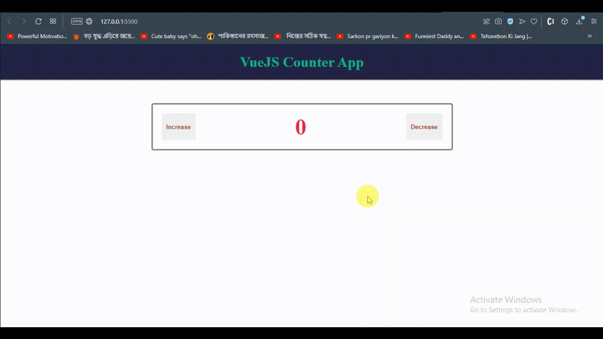

# Title-Info
> This is my first vue.js project with readme and setup. Grnerally it is a simple counter app.

# GIF

## Built With
- HTML
- CSS
- JavaScript
- VueJS

## Live Demo
For the link to the live demo, [Click here]

## Getting Started
To get a local copy up and running you just need to follow the following steps;
- Clone this repository with
git clone https://github.com/asifmuntasir/vue-counter-app.git using your terminal or command line.
- run code `.` to open it in vscode
- start live server
- then enjoy the code

## Author

👤 **Asif Muntasir**

- GitHub: [Asif_Muntasir](https://github.com/asifmuntasir)
- LinkedIn: [Asif_Muntasir](https://www.linkedin.com/in/asif-muntasir-shuaib/)

## 🤝 Contributing

Contributions, issues, and feature requests are welcome!

Feel free to check the [issues page](../../issues/).

## Show your support

Give a ⭐️ if you like this project!

## Acknowledgments

- Mamunur Rashid

## 📝 License

This project is [MIT](./MIT.md) licensed.
